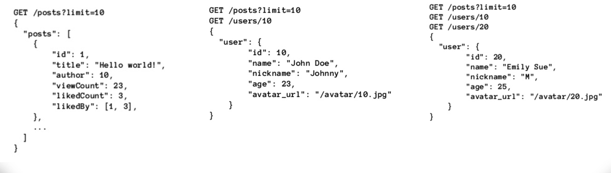

# GRAPHQL

## ¿Qué es ?

* GraphQL es a data query language and runtime para enviar y solicitar data a Mobile apps y Web apps desde 2012. 

* Es una arquitectura que se basa en definición de Tipos y Atributos (cada operación debe tener un tipo y atributos)

* A Diferencia de REST, GraphQL necesita de Clientes Especiales

* Tiene diferentes operaciones  llamadas  **Query** (Read)  y **Mutation** (Create,Update y Delete)

* Solo utiliza método **POST** para realizar cualquier operación.

* Fue creado por Facebook y liberado en 2015.

## Ventajas

* Tiene una forma declarativa de obtener data.

* Se envía solo la información que se necesita.

* Una única  fuente de la verdad.

* Amigable con Frameworks y Lenguajes.

* Auto Documentación.

* No necesita versionamiento.

* Fuertemente Tipado.

* Un comunidad creciendo día con día.

## ¿Quiénes lo usan?

* **Facebook:** [Graph API](https://developers.facebook.com/docs/graph-api/)

* **GitHub:** [Github API v4](https://developer.github.com/v4/)
  
* **New York Times:** [React and GraphQL at the NYTimes](https://softwareengineeringdaily.com/2018/10/22/react-and-graphql-at-the-nytimes/)

* **Coursera:** [Coursera's GraphQL API Evolution](https://www.graphql.com/articles/coursera-graphql)

* **Yelp:** [Yelp GraphQL API](https://www.yelp.com/developers/graphql/guides/intro)

## Problemas que resuelve

### Problema Nº 1: Varias peticiones en un solo viaje.

 En REST cuando se envia a un recurso con relaciones (One To One, One To Many, Many To Many), Las relaciones en el JSON son representadas por el ID del recurso haciendo que sea necesario hacer otra petición para obtener información del recurso relacionado, esto se vuelve un problema cuando son muchos recursos relacionados a los que se tiene que acceder para dar más detalle en el cliente.

**Posible Solución:** Crear un endpoint */newsfeed/* 

### Problema Nº 2: Data innecesaria

Si tenemos una aplicación de un blog donde tenemos un atributo llamado “views_count”  que en una nueva version vamos a quitar de la aplicacion, pero debemos seguir  soportando las viejas versiones de la aplicación , entonces la nuevas versiones no aceptan views_count, pero las viejas versiones Si. Al quitar de la api el campo "views_count", las viejas aplicaciones tendran problemas y si dejamos el campo es data innecesaria que hace mas pesado el JSON

